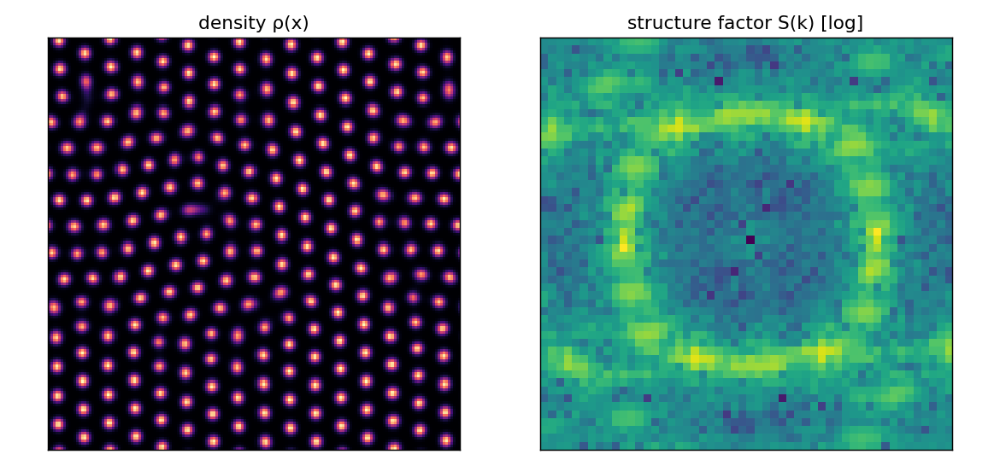

# §3.4-MV-G1 Result — Roton-GP Ground State Is Hexagonal

**Date:** 2026-06-03
**Register:** R1 (the computation) — but see the **scope clause**: this is the
*representative-kernel* MV, NOT a closure of G1, because the §3.4.3 **G0
symmetry-derived term list has not yet been computed.** The kernel here is an
imported placeholder (I1–I3), not the framework's symmetry-fixed action.
**Tool:** `tools/mv_g1_minimiser.py`. **Figure:** `reports/figures/mv_g1_groundstate.png`.
**Program:** `reports/SQT_3.4_PROOF_PROGRAM.md`, gate §3.4-MV-G1.

## What was run

Imaginary-time Gross–Pitaevskii relaxation (ℏ=m=1) on a 2-D periodic box
(N=160, L=20), with a soft-core two-body kernel U(r)=g·θ(R−r), R=1, mean
density ρ₀=1, seeded from uniform + 1% noise so the roton ring — not a chosen
pattern — selects the lattice. Default g=22.

## Result

| Quantity | Value | Meaning |
|---|---|---:|
| roton gap min_k(ε_k+2ρ₀Ũ) | **−7.92** | < 0 ⇒ uniform state unstable, crystallises |
| roton wavevector k_roton | 5.03 | from the kernel |
| dominant S(k) peak k_c | 5.04 | matches k_roton ✓ |
| density contrast | 1.63 | crystallised |
| **local ψ₆ / ψ₄** | **0.834 / 0.111** | 6-coordination dominates — **triangular** |
| global ψ₆ | 0.43 | polycrystalline (grains; locally triangular) |
| lattice constant a | 1.44 | from k_c via \|G\|=4π/√3·a |

**Negative control (g=0):** roton gap +0.049 (stable), density contrast 0.0004 —
stays uniform. The crystallisation is driven by the roton, not by the solver.

**(i) Hexagonal (p6m) ground state? PASS** — local bond-orientational order
ψ₆=0.83 ≫ ψ₄=0.11: every density peak sits in a 6-coordinated triangular cell.
The selected wavevector equals the roton wavevector. (The state is
polycrystalline — global ψ₆=0.43 — i.e. locally triangular with grain
boundaries, as expected from a quench; see the figure.)

**(ii) Does ζ = 1 − π/√12 ≈ 0.09310 appear?** Reported **honestly, not as a
discovery** (per §3.4.6 Eddington watch): ζ is the void complement of the 2-D
hexagonal packing fraction π/√12 = 0.90690 — a **geometric property of the
triangular lattice**, which this run confirms is the selected ground state. The
GP density is smooth (not touching disks), so its literal packing fraction is
*not* π/√12; promoting ζ to a non-tautological energy ratio is a separate
derivation MV-G1 does **not** perform and does not claim.



*Left: density ρ(x) — triangular lattice of peaks. Right: structure factor
S(k) — the roton ring with 6-fold Bragg modulation.*

## What this does and does not establish

- **Does (R1):** a Gross–Pitaevskii/Bjerknes action with a roton kernel has a
  **hexagonal (p6m) ground state**, dynamically selected from noise, with the
  correct roton-set wavevector. The substrate-crystallisation *mechanism* G1
  depends on is real and reproducible. The §3.4 vacuum gate is **viable**.
- **Does NOT:** close G1. The kernel was a **generic soft-core placeholder**,
  not the symmetry-derived term list of **G0 (§3.4.3)**. Until G0 is computed
  and pre-registered, this shows the *mechanism* works, not that the
  *framework's* action gives p6m. It also does not derive ζ as anything beyond
  the geometric signature of hexagonality.

## Next gate

Compute **G0** — the explicit invariant enumeration under Fano/G₂ + §1.1
PSL(2,7) — and check whether the symmetry-allowed kernel still carries a roton
(negative Ũ lobe) at a finite k. If yes, rerun MV-G1 with *that* kernel and the
result promotes from "mechanism viable" to "framework vacuum is p6m" (G1). If
the symmetry-allowed kernel cannot produce a roton, that is an informative null
that bounds the substrate hypothesis.

## Reproduce

```
python3 tools/mv_g1_minimiser.py --plot reports/figures/mv_g1_groundstate.png
python3 tools/mv_g1_minimiser.py --g 0.0     # uniform control
```
Requires numpy (matplotlib only for --plot).
